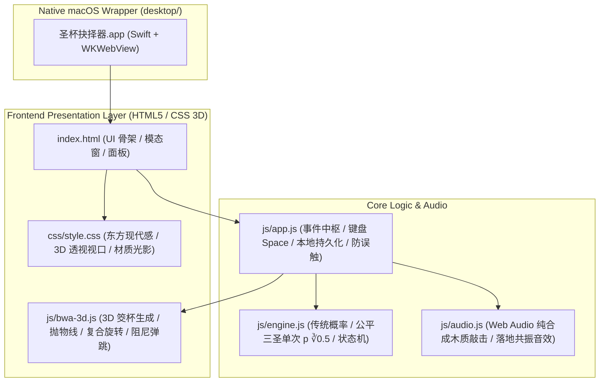

# 圣杯抉择器 (Holy Grail Decision) 实现计划

> **For agentic workers:** REQUIRED SUB-SKILL: Use superpowers:subagent-driven-development to implement this plan task-by-task. Steps use checkbox (`- [ ]`) syntax for tracking.

**Goal:** 实现一个个人本地使用的“圣杯抉择器”轻量应用，具备极致 3D 物理翻转动效、程序化木质音效、严谨传统/公平三圣概率模型，并封装为仅约 25MB 内存的 macOS 原生独立桌面 App（同时支持浏览器直接双击打开）。

**Architecture:** 采用纯原生前端技术栈（HTML5 + CSS 3D + 原生 JS ES 模块 + Web Audio 振荡器合成），无需外部库与打包工具。核心概率计算与跨点击累计状态机独立解耦，由 Node 原生单元测试保障严密性；通过系统级 `swiftc` 编译器直调 macOS 原生 `WKWebView` 封装为超轻独立小窗口应用。

**Architecture Diagram:**



**Tech Stack:**
- 前端核心：HTML5, Modern CSS (3D transforms, `:has()`, flex/grid), Vanilla JavaScript (ES2022)
- 音效：Web Audio API (OscillatorNode, BiquadFilterNode, GainNode 拟真物理敲击)
- 测试：Node.js 内置 `node:test` + `node:assert`（0 外部 npm 依赖）
- 桌面包装：Apple Swift 6 (`swiftc`), Cocoa `NSApplication` + `WKWebView` (~200KB 二进制, ~25MB 内存)

## Global Constraints
- 严格遵循去迷信化规范，文案全流程保持现代、科学决策风格。
- 公平三圣单次概率必须精确使用 $p = \sqrt[3]{0.5} \approx 0.793700526$，笑杯和阴杯各占 $10.3149737\%$。
- 每次点击只投一次，禁止自动连续随机；一旦决断完成（A 或 B），必须锁定投掷，必须点击“开始下一轮”才清零计数。
- 在轮次进行中若切换模式或修改选项，必须给出确认提醒并重开轮次，禁止状态静默继承。
- 零第三方 npm 依赖，零外部网络资源，零外部音频文件。

---

### Task 1: 核心数学概率引擎与状态机 (TDD)

**Files:**
- Create: `js/engine.js`
- Create: `tests/engine.test.js`

**Interfaces:**
- Consumes: None
- Produces:
  - `DecisionEngine` 类：
    - `constructor(mode = 'fair', tripleSacred = true, optionA = '选择 A', optionB = '选择 B')`
    - `setMode(mode, tripleSacred)`: 切换模式，重置状态
    - `setOptions(a, b)`: 更新选项 A/B
    - `throwOnce()`: 返回 `{ singleResult: 'sacred'|'laugh'|'yin', cups: ['yin'|'yang', 'yin'|'yang'], progress: { current, total }, isFinished, finalDecision: 'A'|'B'|null, isInterrupted }`
    - `resetRound()`: 重置当前轮次计数
    - `getHistory()`: 获取历史流水

- [ ] **Step 1: 编写 engine.test.js 涵盖所有核心规则与概率边界**

```javascript
// tests/engine.test.js
const test = require('node:test');
const assert = require('node:assert');
const { DecisionEngine, FAIR_P_SACRED, FAIR_P_LAUGH, FAIR_P_YIN } = require('../js/engine.js');

test('Fair probability constants', () => {
  assert.ok(Math.abs(FAIR_P_SACRED - Math.cbrt(0.5)) < 1e-6);
  assert.ok(Math.abs(FAIR_P_LAUGH - (1 - FAIR_P_SACRED) / 2) < 1e-6);
  assert.ok(Math.abs(FAIR_P_YIN - (1 - FAIR_P_SACRED) / 2) < 1e-6);
});

test('Traditional mode without triple sacred', () => {
  const engine = new DecisionEngine('traditional', false, 'A', 'B');
  // Mock custom random to test deterministically
  engine.randomFn = () => [0.1, 0.6]; // Yin (0.1 < 0.5) + Yang (0.6 >= 0.5) => Sacred
  const res = engine.throwOnce();
  assert.strictEqual(res.singleResult, 'sacred');
  assert.strictEqual(res.isFinished, true);
  assert.strictEqual(res.finalDecision, 'A');
});

test('Traditional mode with triple sacred: 3 sacred in a row yields A', () => {
  const engine = new DecisionEngine('traditional', true, 'A', 'B');
  engine.randomFn = () => [0.1, 0.6]; // Sacred

  let res = engine.throwOnce();
  assert.strictEqual(res.progress.current, 1);
  assert.strictEqual(res.isFinished, false);
  assert.strictEqual(res.finalDecision, null);

  res = engine.throwOnce();
  assert.strictEqual(res.progress.current, 2);
  assert.strictEqual(res.isFinished, false);

  res = engine.throwOnce();
  assert.strictEqual(res.progress.current, 3);
  assert.strictEqual(res.isFinished, true);
  assert.strictEqual(res.finalDecision, 'A');
});

test('Fair mode: interruption on non-sacred leads to B immediately', () => {
  const engine = new DecisionEngine('fair', true, 'A', 'B');
  // First throw: sacred (rand < 0.7937)
  engine.randomVal = () => 0.2;
  let res = engine.throwOnce();
  assert.strictEqual(res.singleResult, 'sacred');
  assert.strictEqual(res.progress.current, 1);
  assert.strictEqual(res.isFinished, false);

  // Second throw: laugh (rand in laugh range)
  engine.randomVal = () => 0.85;
  res = engine.throwOnce();
  assert.strictEqual(res.singleResult, 'laugh');
  assert.strictEqual(res.isFinished, true);
  assert.strictEqual(res.finalDecision, 'B');
  assert.strictEqual(res.isInterrupted, true);
});

test('Monte Carlo sanity test for Fair Mode (50% final decision)', () => {
  const trials = 10000;
  let aCount = 0;
  for (let i = 0; i < trials; i++) {
    const engine = new DecisionEngine('fair', true, 'A', 'B');
    while (!engine.state.isFinished) {
      engine.throwOnce();
    }
    if (engine.state.finalDecision === 'A') aCount++;
  }
  const aRatio = aCount / trials;
  // Should be close to 0.5 within +/- 0.02 tolerance
  assert.ok(Math.abs(aRatio - 0.5) < 0.02, `A ratio was ${aRatio}, expected ~0.5`);
});
```

- [ ] **Step 2: 运行测试并验证其报错（引擎未实现）**

Run: `node --test tests/engine.test.js`
Expected: Cannot find module '../js/engine.js'

- [ ] **Step 3: 实现 `js/engine.js`**

编写完整数学概率与状态机逻辑，支持 CommonJS/ESM 双环境导入。

```javascript
// js/engine.js
const FAIR_P_SACRED = Math.cbrt(0.5); // ~0.7937005259840998
const FAIR_P_LAUGH = (1 - FAIR_P_SACRED) / 2; // ~0.1031497370079501
const FAIR_P_YIN = FAIR_P_LAUGH; // ~0.1031497370079501

class DecisionEngine {
  constructor(mode = 'fair', tripleSacred = true, optionA = '选项 A', optionB = '选项 B') {
    this.mode = mode; // 'fair' | 'traditional'
    this.tripleSacred = mode === 'fair' ? true : tripleSacred;
    this.optionA = optionA;
    this.optionB = optionB;
    this.randomFn = null; // for testing
    this.randomVal = null; // for testing

    this.resetRound();
    this.history = [];
  }

  resetRound() {
    this.state = {
      roundCount: 0,
      consecutiveSacred: 0,
      targetSacred: (this.mode === 'fair' || this.tripleSacred) ? 3 : 1,
      isFinished: false,
      finalDecision: null,
      isInterrupted: false,
      lastThrow: null
    };
  }

  setMode(mode, tripleSacred = false) {
    this.mode = mode;
    this.tripleSacred = mode === 'fair' ? true : tripleSacred;
    this.resetRound();
  }

  setOptions(a, b) {
    this.optionA = a;
    this.optionB = b;
  }

  _getRandomVal() {
    return this.randomVal ? this.randomVal() : Math.random();
  }

  _getRandomPair() {
    if (this.randomFn) return this.randomFn();
    return [Math.random(), Math.random()];
  }

  throwOnce() {
    if (this.state.isFinished) {
      throw new Error('当前轮次已结束，请先开始下一轮');
    }

    this.state.roundCount++;
    let singleResult = '';
    let cups = []; // ['yin'|'yang', 'yin'|'yang']

    if (this.mode === 'traditional') {
      // Each cup independently 50% Yin (flat), 50% Yang (convex)
      const [r1, r2] = this._getRandomPair();
      const c1 = r1 < 0.5 ? 'yin' : 'yang';
      const c2 = r2 < 0.5 ? 'yin' : 'yang';
      cups = [c1, c2];

      if ((c1 === 'yin' && c2 === 'yang') || (c1 === 'yang' && c2 === 'yin')) {
        singleResult = 'sacred'; // 一阴一阳
      } else if (c1 === 'yang' && c2 === 'yang') {
        singleResult = 'laugh'; // 两阳
      } else {
        singleResult = 'yin'; // 两阴
      }
    } else {
      // Fair mode: sample directly from strict ∛0.5 distribution
      const r = this._getRandomVal();
      if (r < FAIR_P_SACRED) {
        singleResult = 'sacred';
        cups = Math.random() < 0.5 ? ['yin', 'yang'] : ['yang', 'yin'];
      } else if (r < FAIR_P_SACRED + FAIR_P_LAUGH) {
        singleResult = 'laugh';
        cups = ['yang', 'yang'];
      } else {
        singleResult = 'yin';
        cups = ['yin', 'yin'];
      }
    }

    // State machine logic
    let isFinished = false;
    let finalDecision = null;
    let isInterrupted = false;

    if (this.mode === 'fair' || this.tripleSacred) {
      // Triple sacred rule active
      if (singleResult === 'sacred') {
        this.state.consecutiveSacred++;
        if (this.state.consecutiveSacred === 3) {
          isFinished = true;
          finalDecision = 'A';
        }
      } else {
        // Laugh or Yin breaks streak -> directly B
        isFinished = true;
        finalDecision = 'B';
        isInterrupted = true;
      }
    } else {
      // Traditional default rule (single throw)
      if (singleResult === 'sacred') {
        isFinished = true;
        finalDecision = 'A';
      } else if (singleResult === 'yin') {
        isFinished = true;
        finalDecision = 'B';
      } else {
        // Laugh: can continue, no final decision yet
        isFinished = false;
        finalDecision = null;
      }
    }

    this.state.isFinished = isFinished;
    this.state.finalDecision = finalDecision;
    this.state.isInterrupted = isInterrupted;

    const throwRecord = {
      roundIndex: this.state.roundCount,
      singleResult,
      cups,
      progress: {
        current: this.state.consecutiveSacred,
        total: (this.mode === 'fair' || this.tripleSacred) ? 3 : 1
      },
      isFinished,
      finalDecision,
      isInterrupted,
      timestamp: Date.now()
    };

    this.state.lastThrow = throwRecord;
    return throwRecord;
  }
}

if (typeof module !== 'undefined' && module.exports) {
  module.exports = { DecisionEngine, FAIR_P_SACRED, FAIR_P_LAUGH, FAIR_P_YIN };
}
```

- [ ] **Step 4: 运行 `node --test tests/engine.test.js` 并验证全部通过**

Run: `node --test tests/engine.test.js`
Expected: 5 pass, 0 fail.

- [ ] **Step 5: 提交代码**

`git add js/engine.js tests/engine.test.js && git commit -m "feat: implement decision engine with strict probabilities and tests"`

---

### Task 2: 纯程序化 Web Audio 拟真音效合成器

**Files:**
- Create: `js/audio.js`

**Interfaces:**
- Consumes: Web Audio API (`AudioContext`)
- Produces:
  - `SoundController` 类：
    - `playClack()`: 播放筊杯在空中碰撞的清脆木鸣声
    - `playLand(cupType, bounceIndex)`: 播放落地撞击与桌面共振声（随弹跳次数衰减，阳面落定带微弱木震）
    - `toggleMute()` / `isMuted()`

- [ ] **Step 1: 实现 `js/audio.js` 原生合成音效**

利用振荡器合成木质频谱（Wood Resonance: 基频 ~450Hz ~ 800Hz，短衰减包络），配合微量白噪声模拟木质纤维碰撞摩擦，无需加载任何音频文件。

```javascript
// js/audio.js
class SoundController {
  constructor() {
    this.ctx = null;
    this.muted = localStorage.getItem('hg_muted') === 'true';
  }

  _initContext() {
    if (!this.ctx && typeof window !== 'undefined' && (window.AudioContext || window.webkitAudioContext)) {
      const AudioCtx = window.AudioContext || window.webkitAudioContext;
      this.ctx = new AudioCtx();
    }
    if (this.ctx && this.ctx.state === 'suspended') {
      this.ctx.resume();
    }
  }

  toggleMute() {
    this.muted = !this.muted;
    localStorage.setItem('hg_muted', this.muted);
    return this.muted;
  }

  playClack() {
    if (this.muted) return;
    this._initContext();
    if (!this.ctx) return;

    const t = this.ctx.currentTime;
    const osc = this.ctx.createOscillator();
    const gain = this.ctx.createGain();
    const filter = this.ctx.createBiquadFilter();

    osc.type = 'triangle';
    osc.frequency.setValueAtTime(680, t);
    osc.frequency.exponentialRampToValueAtTime(320, t + 0.06);

    filter.type = 'bandpass';
    filter.frequency.setValueAtTime(800, t);
    filter.Q.setValueAtTime(4.0, t);

    gain.gain.setValueAtTime(0.35, t);
    gain.gain.exponentialRampToValueAtTime(0.001, t + 0.08);

    osc.connect(filter);
    filter.connect(gain);
    gain.connect(this.ctx.destination);

    osc.start(t);
    osc.stop(t + 0.09);
  }

  playLand(bounceLevel = 0, isConvex = false) {
    if (this.muted) return;
    this._initContext();
    if (!this.ctx) return;

    const t = this.ctx.currentTime;
    const osc = this.ctx.createOscillator();
    const gain = this.ctx.createGain();

    const freq = isConvex ? 280 : 340;
    const volume = Math.max(0.05, 0.45 / Math.pow(1.8, bounceLevel));
    const duration = isConvex ? 0.12 : 0.08;

    osc.type = 'sine';
    osc.frequency.setValueAtTime(freq, t);
    osc.frequency.exponentialRampToValueAtTime(110, t + duration);

    gain.gain.setValueAtTime(volume, t);
    gain.gain.exponentialRampToValueAtTime(0.001, t + duration);

    osc.connect(gain);
    gain.connect(this.ctx.destination);

    osc.start(t);
    osc.stop(t + duration + 0.01);
  }
}
```

- [ ] **Step 2: 验证语法无误**

Run: `node -c js/audio.js`
Expected: 语法校验通过，无语法错误。

- [ ] **Step 3: 提交代码**

`git add js/audio.js && git commit -m "feat: add procedural web audio wood synthesizer"`

---

### Task 3: 3D 筊杯建模与逼真物理抛掷、翻转、阻尼弹跳动效

**Files:**
- Create: `js/bwa-3d.js`
- Create: `css/style.css` (3D 舞台、材质光影与关键帧)

**Interfaces:**
- Consumes: DOM 容器 (`#stage-3d`), `SoundController`
- Produces:
  - `Bwa3DStage` 类：
    - `constructor(containerEl, soundController)`
    - `renderCups(cupsState)`: 静态呈现或初始化位置
    - `throwAnimation(cupsResult, callback)`: 执行 ~1s 的起跳、3D 空间自旋翻滚、落地弹跳阻尼衰减动画并在关键帧触发打击音效与回调

- [ ] **Step 1: 编写 CSS 3D 舞台与月牙几何材质样式 (`css/style.css`)**

实现支持硬件加速的 3D 透视视口（`perspective: 900px`, `transform-style: preserve-3d`），构建月牙形筊杯（阴面平面深木色内衬、阳面半圆拱凸起与立体高光渐变），桌面实时动态阴影。

- [ ] **Step 2: 实现 `js/bwa-3d.js` 物理动画引擎**

计算空间自由翻滚随机角速度与最终落定角度（阳面 `rotateX(180deg)`，阴面 `rotateX(0deg)`），在接触桌面的时序精确触发 `soundController.playLand(bounceIndex)`。

- [ ] **Step 3: 语法校验**

Run: `node -c js/bwa-3d.js`
Expected: 语法通过

- [ ] **Step 4: 提交代码**

`git add css/style.css js/bwa-3d.js && git commit -m "feat: create 3D bwa physics and animation stage"`

---

### Task 4: 主界面交互、状态机联动与持久化防污染

**Files:**
- Create: `index.html`
- Create: `js/app.js`

**Interfaces:**
- Consumes: `DecisionEngine`, `SoundController`, `Bwa3DStage`
- Produces: 完整现代 UI、模式切换、选项输入、快捷键、历史抽屉与 localStorage 存储

- [ ] **Step 1: 编写语义化现代 UI 界面 (`index.html`)**
  - 顶栏：模式切换（传统 / 公平三圣）、模式说明问号浮层、音效开关。
  - 抉择输入卡片：问题内容、选项 A、选项 B。
  - 3D 投掷台：包含 2 个三维筊杯与阴影、当前连续进度条（1/3, 2/3, 3/3）。
  - 控制按钮栏：“掷一次 (Space)”与终局“开始下一轮”；重开/重置按钮。
  - 决策结果高亮展示区。
  - 历史流水面板：区分单次过程明细与最终决定，附带“清空”与“导出 JSON”。
  - 防误触确认弹窗（正在轮次中修改选项/切模式时提示）。

- [ ] **Step 2: 编写 `js/app.js` 胶水层与防污染逻辑**
  - 绑定快捷键（空格键掷杯，Enter 下一轮）。
  - 投掷中禁用按钮与键盘，防止狂按冲突。
  - 监听输入与模式切换，如处于未完结轮次则调起确认弹窗。
  - 本地 localStorage 记录留存与恢复。

- [ ] **Step 3: 语法与结构校验**

Run: `node -c js/app.js`
Expected: 语法检查通过

- [ ] **Step 4: 提交代码**

`git add index.html js/app.js && git commit -m "feat: assemble interactive UI, event handling and local storage"`

---

### Task 5: macOS 原生独立 App 包装与构建脚本

**Files:**
- Create: `desktop/main.swift`
- Create: `desktop/build_app.sh`

**Interfaces:**
- Consumes: 系统 `swiftc`, WebKit 框架, 本地 `index.html`
- Produces: `圣杯抉择器.app` (极小 ~200KB 体积，~25MB 内存占用)

- [ ] **Step 1: 编写极简原生 Swift 封装 (`desktop/main.swift`)**

创建无地址栏、固定精致尺寸（420x720）、居中弹出的原生 macOS 窗口，加载本地 HTML 页面，处理窗口关闭与原生退出事件。

- [ ] **Step 2: 编写一键编译打包脚本 (`desktop/build_app.sh`)**

自动生成标准的 macOS `.app` 包目录结构（`Contents/MacOS/`, `Contents/Resources/`, `Info.plist`），一键调用 `swiftc` 极速编译生成独立运行的 `圣杯抉择器.app`。

- [ ] **Step 3: 执行构建并验证生成产物**

Run: `bash desktop/build_app.sh`
Expected: 成功生成 `圣杯抉择器.app`，体积小于 1MB。

- [ ] **Step 4: 提交代码**

`git add desktop/ && git commit -m "feat: add lightweight native macOS desktop app wrapper"`

---

### Task 6: 端到端功能测试与视觉动效验证

**Files:**
- 验证所有模块连通性与视觉交互

- [ ] **Step 1: 运行单元测试**

Run: `node --test tests/engine.test.js`
Expected: 全部测试通过

- [ ] **Step 2: 启动本地独立 App 或浏览器验证核心功能**
  - 验证传统模式（单次圣杯选 A，单次阴杯选 B，笑杯可继续）。
  - 验证传统模式开启“连续三圣”（12.5% A 提示，中途非圣杯选 B）。
  - 验证公平三圣模式（显示 1/3, 2/3, 3/3 进度；第 1/2/3 投笑/阴直接选 B；连续 3 圣选 A）。
  - 验证 3D 翻滚与阻尼弹跳动效流畅度，音效清脆正常。
  - 验证历史流水正确记录过程与最终结果。
  - 验证中途修改 A/B 时的防污染弹窗提示。

- [ ] **Step 3: 最终 Git 提交与完成交付**
